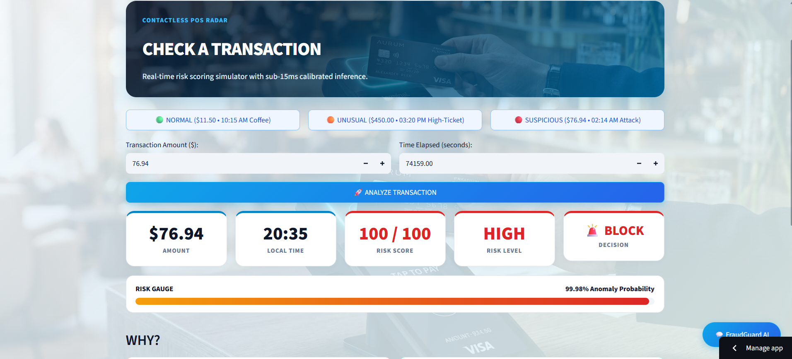
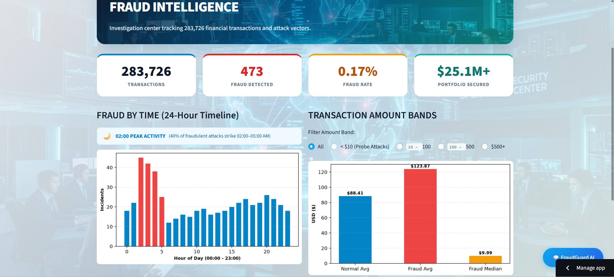
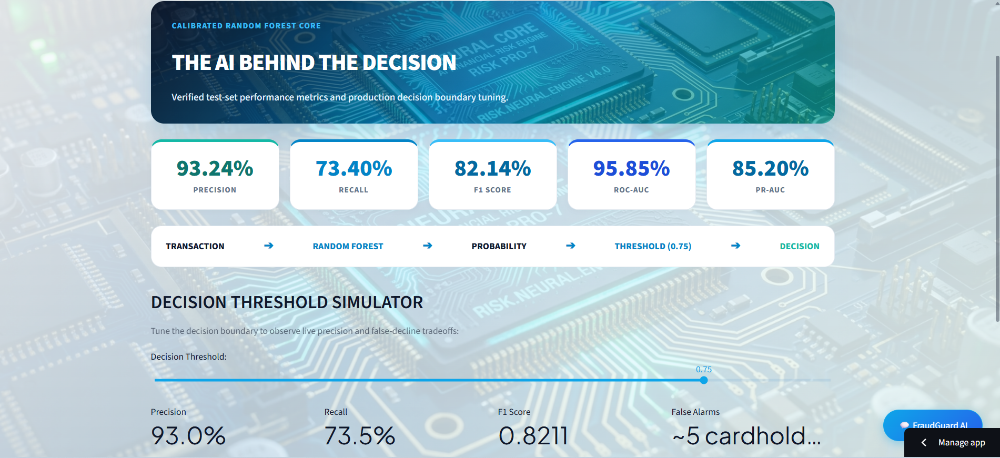
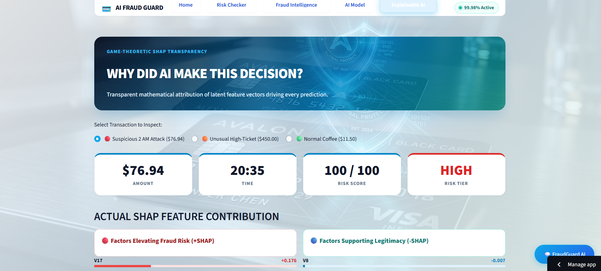
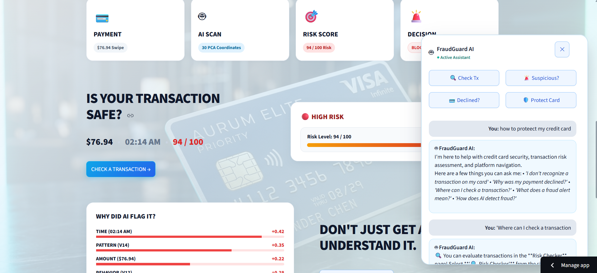

# 💳 AI Fraud Guard

### AI-Powered Credit Card Fraud Detection Platform

AI Fraud Guard is an end-to-end **Data Science and Machine Learning application** that analyzes credit card transactions, estimates fraud risk, explains model decisions, and provides interactive fraud intelligence through a FinTech-style web application.

Built with **Python, Machine Learning, SQL, Explainable AI, FastAPI and Streamlit**.

---

## 🚀 Live Demo

🌐 **Live Application:**  
https://ai-fraud-guard.streamlit.app/

💻 **GitHub Repository:**  
https://github.com/kummetha-manaswi/credit-card-fraud-detection

---

## 📸 Application Preview

### 🏠 Home

### 🔍 Transaction Risk Checker

### 📊 Fraud Intelligence

### 🤖 AI Model

### 🧠 Explainable AI

### 🤖 FraudGuard AI

---

## 🎯 Project Overview

Credit card fraud detection is a highly imbalanced machine learning problem because fraudulent transactions represent only a very small fraction of total transactions.

Instead of stopping at model training, this project turns the complete machine learning workflow into an interactive application.

The platform combines:

- 🔍 Transaction risk assessment
- 📊 Fraud analytics
- 🗄️ SQL-based analysis
- 🤖 AI-powered fraud assistant
- 🧠 SHAP Explainable AI
- ⚡ FastAPI prediction service
- 🧪 Automated testing
- 🎨 FinTech-style interactive interface

---

## 📊 Model Performance

The dataset contains a highly imbalanced fraud class, with fraudulent transactions representing approximately **0.1667%** of the data.

The final machine learning workflow uses:

- SMOTE for training-data class balancing
- Random Forest classification
- Probability-based prediction
- Decision threshold optimization
- Production decision threshold of **0.75**

### Test Set Performance

| Metric | Random Forest |
|---|---:|
| Precision | **93.24%** |
| Recall | **72.63%** |
| F1 Score | **81.66%** |
| ROC-AUC | **97.68%** |
| PR-AUC | **79.74%** |

### Model Comparison

| Model | Precision | Recall | F1 | ROC-AUC | PR-AUC |
|---|---:|---:|---:|---:|---:|
| Logistic Regression | 10.74% | 87.37% | 19.12% | 96.44% | 65.32% |
| Random Forest | **93.24%** | **72.63%** | **81.66%** | **97.68%** | **79.74%** |

The Random Forest model provides a substantially stronger precision/F1 balance than the Logistic Regression baseline at the selected operating threshold.

### Confusion Matrix

| | Predicted Legitimate | Predicted Fraud |
|---|---:|---:|
| **Actual Legitimate** | 56,646 | 5 |
| **Actual Fraud** | 26 | 69 |

At the selected threshold of **0.75**, the model identified **69 fraudulent transactions** with **5 false positives** on the evaluated test set.

---

## 🖥️ Application Features

### 🔍 Transaction Risk Checker

An interactive transaction risk assessment interface.

#### Simple Mode

Designed for normal users.

Users can interact with:

- Transaction amount
- Transaction time
- Pre-loaded transaction scenarios
- Risk score
- Risk level
- Fraud decision
- Risk probability

The underlying `V1–V28` model features are handled automatically.

#### Advanced Mode

Technical users can inspect the complete model input:

`Time`, `V1–V28`, and `Amount`.

---

### 📊 Fraud Intelligence

An interactive analytics center for exploring fraud patterns.

It includes:

- Total transactions
- Fraud transactions detected
- Fraud rate
- Transaction amount analysis
- Fraud-by-time analysis
- Transaction amount bands
- Fraud vs legitimate patterns
- SQL-powered transaction analysis

The application analyzes **283,726 transactions** with **473 fraudulent transactions** in the processed dataset.

---

### 🤖 FraudGuard AI

FraudGuard AI is a customer-facing assistant designed around transaction and card-security support.

It can help answer questions about:

- Suspicious transactions
- Fraud alerts
- Transaction risk
- Declined payments
- Card protection
- Transaction checking
- Application functionality

The assistant also includes an **offline fallback**, allowing the application to provide rule-based responses without requiring an external LLM API key.

---

### 🧠 Explainable AI

The application uses **SHAP (SHapley Additive exPlanations)** to explain individual model predictions.

The Explainable AI page provides:

- Global feature importance
- Local transaction explanations
- SHAP feature contributions
- Factors increasing fraud risk
- Factors supporting legitimacy
- Individual prediction analysis

This helps answer:

> **"Why did the model make this decision?"**

The dataset's `V1–V28` variables are anonymized PCA-transformed features, so the application does not assign artificial business meanings to them.

---

### 🤖 AI Model

The AI Model page focuses on:

> **"How well does the model work?"**

It provides:

- Precision
- Recall
- F1 Score
- ROC-AUC
- PR-AUC
- Model comparison
- Decision threshold analysis
- Precision-recall trade-offs

A threshold simulator allows users to explore how changing the decision boundary affects model behavior.

**Production threshold: `0.75`**

---

### ⚡ FastAPI Prediction API

The project includes a FastAPI service for model inference.

### Endpoints

- `GET /health`
- `POST /predict`

The prediction pipeline performs:

1. Input validation
2. Feature ordering
3. Feature scaling
4. Random Forest inference
5. Fraud probability calculation
6. Threshold-based classification

Interactive Swagger/OpenAPI documentation is available at:

`/docs`

when the API is running locally.

---

## 🏗️ System Architecture

    Transaction
         ↓
    Data Cleaning
         ↓
    Duplicate Handling
         ↓
    Train / Validation / Test Split
         ↓
    SMOTE on Training Data
         ↓
    Feature Scaling
         ↓
    Random Forest
         ↓
    Fraud Probability
         ↓
    Decision Threshold (0.75)
         ↓
    Fraud / Legitimate Decision
         ↓
    ┌───────────────┬────────────────┬──────────────────┐
    ↓               ↓                ↓
    Streamlit     FastAPI       SHAP Explainability
    ↓               ↓                ↓
    User UI      API Clients     Model Insights

---

## 🧠 Machine Learning Pipeline

The core Data Science workflow consists of:

1. Data exploration
2. Data cleaning
3. Duplicate handling
4. Train/validation/test splitting
5. Class imbalance analysis
6. SMOTE on training data
7. Feature scaling
8. Logistic Regression baseline
9. Random Forest training
10. Probability prediction
11. Decision threshold optimization
12. Model evaluation
13. SHAP explainability
14. Application integration

---

## 🔬 Understanding V1–V28

The dataset contains:

- `Time`
- `V1–V28`
- `Amount`
- `Class`

The `V1–V28` variables are **anonymized PCA-transformed numerical features** supplied by the dataset.

They are not direct business attributes such as:

- Customer age
- Customer location
- Merchant
- Card type
- Customer income

Because their original meanings are anonymized, the application does not invent interpretations for them.

In **Simple Mode**, users do not need to manually enter these variables.

The general flow is:

    Transaction Data
          ↓
    Existing V1–V28 Features
          ↓
    Preprocessing
          ↓
    Random Forest
          ↓
    Fraud Probability
          ↓
    Risk Decision

---

## 🛠️ Technology Stack

### Programming

- Python

### Data Science

- Pandas
- NumPy
- Data Visualization
- Exploratory Data Analysis
- SQL Analytics

### Machine Learning

- Scikit-learn
- Random Forest
- Logistic Regression
- SMOTE
- Feature Scaling
- Threshold Optimization

### Explainable AI

- SHAP

### Backend

- FastAPI
- Pydantic
- Uvicorn

### Database

- SQLite
- SQL

### Frontend

- Streamlit

### Testing

- Pytest

### Development

- Jupyter Notebook
- Git
- GitHub

---

## 📁 Project Structure

    credit-card-fraud-detection/
    │
    ├── .streamlit/
    │   └── config.toml
    │
    ├── api/
    │   ├── __init__.py
    │   ├── app.py
    │   └── schemas.py
    │
    ├── assets/
    │   ├── card_hero.jpg
    │   ├── card_shield.jpg
    │   ├── neural_chip.jpg
    │   ├── payment_pos.jpg
    │   └── security_center.jpg
    │
    ├── data/
    │   └── sample_transactions.csv
    │
    ├── model_artifacts/
    │   ├── features.pkl
    │   ├── random_forest_model.pkl
    │   ├── scaler.pkl
    │   └── threshold.pkl
    │
    ├── screenshots/
    │   ├── home.png
    │   ├── risk-checker.png
    │   ├── fraud-intelligence.png
    │   ├── ai-model.png
    │   ├── explainable-ai.png
    │   └── fraudguard-ai.png
    │
    ├── src/
    │   ├── __init__.py
    │   ├── assistant.py
    │   ├── explainer.py
    │   ├── predictor.py
    │   └── sql_analytics.py
    │
    ├── tests/
    │   ├── __init__.py
    │   ├── test_api.py
    │   ├── test_assistant.py
    │   ├── test_predictor.py
    │   └── test_sql.py
    │
    ├── Credit_Card_Fraud_Detection.ipynb
    ├── app.py
    ├── streamlit_app.py
    ├── requirements.txt
    ├── README.md
    └── .gitignore

---

## 🚀 Run Locally

### 1. Clone the repository

    git clone https://github.com/kummetha-manaswi/credit-card-fraud-detection.git
    cd credit-card-fraud-detection

### 2. Install dependencies

    pip install -r requirements.txt

### 3. Run automated tests

    pytest -v

### 4. Start Streamlit

    streamlit run streamlit_app.py

### 5. Start FastAPI

    uvicorn api.app:app --reload --port 8000

FastAPI Swagger documentation:

    http://localhost:8000/docs

---

## 🧪 Testing

The project includes automated tests covering:

- Prediction pipeline
- FastAPI endpoints
- SQL analytics
- FraudGuard AI assistant

Run the complete test suite with:

    pytest -v

---

## 📌 Dataset

This project uses the public **Credit Card Fraud Detection** dataset containing transaction records with anonymized PCA features.

The original raw dataset is not included in the repository because of its large file size.

A curated sample dataset is included for application demonstration and testing.

---

## 🌐 Deployment

The Streamlit application is deployed using **Streamlit Community Cloud**.

### Application

https://ai-fraud-guard.streamlit.app/

### Entry Point

    streamlit_app.py

The application can be deployed directly from the GitHub repository using Streamlit Community Cloud.

---

## ⚠️ Limitations

This project is an educational and portfolio implementation and should not be treated as a production banking fraud prevention system.

The dataset uses anonymized features and historical transaction data, which do not represent every real-world banking environment.

A production fraud detection system would additionally require:

- Real-time transaction streams
- Customer behavior history
- Merchant information
- Geographic signals
- Device information
- Authentication signals
- Continuous model monitoring
- Data privacy controls
- Security infrastructure
- Model drift monitoring
- Production-grade alerting and investigation workflows

---

## 🎓 What This Project Demonstrates

### Data Science

- Exploratory Data Analysis
- Data Cleaning
- Imbalanced Classification
- Data Visualization
- SQL Analytics

### Machine Learning

- Logistic Regression
- Random Forest
- SMOTE
- Feature Scaling
- Threshold Optimization
- Model Evaluation

### Explainable AI

- SHAP
- Global Feature Importance
- Local Feature Contributions

### Software Engineering

- FastAPI
- Streamlit
- Modular Python Architecture
- Automated Testing
- Model Artifact Management

### Deployment

- Streamlit Community Cloud
- GitHub-based deployment

---

## 💡 Key Takeaway

This project demonstrates the complete journey from:

**Data → Analysis → Machine Learning → Explainability → API → Application → Deployment**

Rather than leaving the model inside a notebook, the project turns the machine learning workflow into an interactive application that users can actually interact with.

---

## 👩‍💻 Author

**Kummetha Manaswi**

Data Science | Machine Learning | AI

GitHub:  
https://github.com/kummetha-manaswi

---

## 📄 License

This project is licensed under the **MIT License**.
